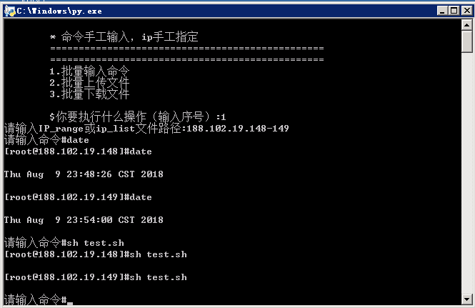

**HuaShell**  
1. 批量执行指定命令：
需要填好params文件夹里的:  
```
ip_list.txt  	#指定指定服务器的ip列表
cmds.txt    	#需要批量执行的命令
```
2. 批量上传文件：
* 需要填好params文件夹里的:
```
ip_list.txt  	#指定指定服务器的ip列表
```
* 将需要上传的所有文件都放在upload_dir里
3. 批量下载文件：  
* 需要填好params文件夹里的:
```
ip_list.txt  	#指定指定服务器的ip列表
```
* 保证download_dir文件夹在批量下载前是空的

---
**HuaShell_pithy**  

* ip可以手动输入ip_range或者文件路径  

    > 示例 1.1.1.1-10,2.2.2.2,3.3.3.3-5  
    > 示例 ip_list.txt  

* 命令手工输入

---
**Function Screenshot**  
  
